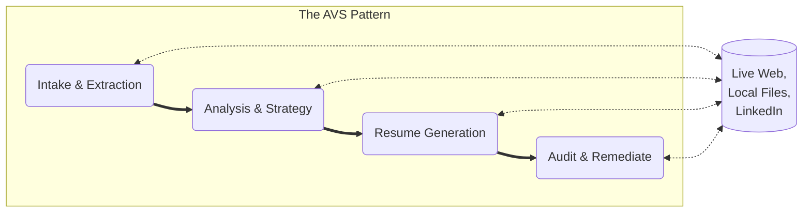

# Illustrative Example: Tailored Resume Generation

This folder contains a sequence of Value Stories that demonstrate how to automate complex resume tailoring while maintaining 100% factual accuracy using the AVS Framework.

## 🔄 The Process Flow



## 0. VS-000: Intake & Extraction

**Goal**: Generate a grounded "Source of Truth" by scraping a job URL and extracting the official company mission, scale, and headquarters.

**Product**: Company Research Brief (The foundation for all subsequent steps).

## 1. VS-001: Analysis & Strategy

**Goal**: Identify key skills and keywords from the job description and map specific candidate achievements to create a Strategic Alignment Matrix.

**Product**: Strategy Report (The "Algorithm" for the drafting phase).

## 2. VS-002: Resume Generation

**Goal**: Produce a fully tailored resume draft that pivots the candidate's narrative (e.g., to 'Technical Product Leader') while incorporating JD-specific keywords.

**Product**: Tailored Resume Draft.

## 3. VS-003: Audit & Remediate (Forensic Gatekeeper)

**Goal**: Perform a forensic cross-reference between the draft and the "Ground Truth" resume to identify and remove any hallucinations.

**Product**: Hallucination Audit Report & Final Remediated Resume.

## 🚀 How to Run

Ensure you have the AVS Toolkit installed and your environment variables (`GEMINI_API_KEY`, `FIRECRAWL_API_KEY`) set.

Run the sequence starting from the intake:

```text
avs assemble ./value-stories/job-hunting/vs-001-logic-analysis.md
```

## 📄 Attribution

Framework by Patrick Heaney (CC BY-SA 4.0). Canonical home: AVS-Orchestration/avs-standard-library.

