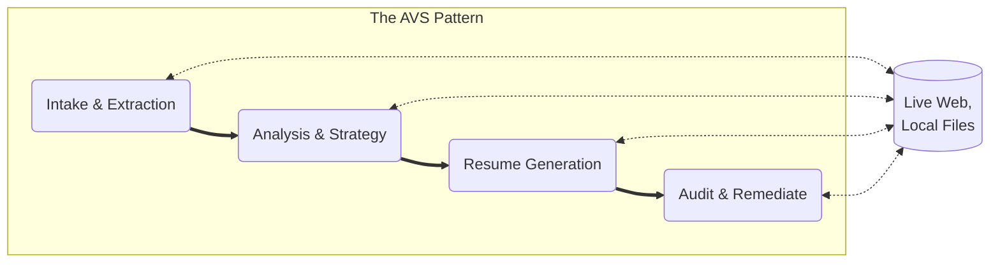

# Illustrative Example: Tailored Resume Generation

This folder contains a sequence of Value Stories that demonstrate how to automate complex resume tailoring while maintaining 100% factual accuracy using the AVS Framework.

## 🔄 The Process Flow



## 🚀 Quick Start: Running the Stream

### 1. 1. Install the AVS Toolkit

Before running the stream, you must have the engine installed on your workstation.

```txt
# Clone the engine
git clone [https://github.com/AVS-Orchestration/avs-toolkit.git](https://github.com/AVS-Orchestration/avs-toolkit.git)
cd avs-toolkit

# Install dependencies and the 'avs' command globally
uv sync
uv pip install -e .

```


Ensure you have the AVS Toolkit installed and your `.env` file is populated with the required API keys (`GEMINI_API_KEY`, `FIRECRAWL_API_KEY`).

### 2. Prepare Your "Ground Truth" Data

The AVS Toolkit is designed to be **Context-Aware**. To prevent hallucinations, you must provide the agent with your actual data.

1. **Create an `inputs/` folder** at the root of your workspace.

2. **Save your Resume**: Save your master resume as inputs/raw-resume.md.

3. **Target a Job**:

    - **Automated**: Open vs-000-intake-extraction.md and update the url in the context_manifest with the job posting link.

    - **Manual**: If the site is blocked, copy the JD text to inputs/job-description.md.

### 📂 Directory Hygiene

Before running, your workspace should look like this.

**⚠️ Important**: For each new job posting you put through the stream, you should update the `output_path` in your Value Stories to a unique `job-folder-name` (e.g., outputs/nvidia-tpm-role/) to keep your results organized and isolated.

```
my-job-hunt/
├── inputs/
│   └── raw-resume.md        <-- Your master data (Manual)
├── outputs/                 
│   └── job-folder-name/     <-- Job-specific outputs (Automatic)
│       ├── VS-000_output.md
│       └── ... 
├── value-stories/
│   └── job-hunting/         <-- This logic directory
└── .env                     <-- Your API Keys
```

### 3. Execute the Stream

Ensure you have the AVS Toolkit installed and your `.env` file contains the necessary API keys.

```txt
# Step 1: Intake (Scrapes JD and generates Company Research Brief)
uv run avs run ./value-stories/job-hunting/vs-000-intake-extraction.md --local

# Step 2: Strategic Analysis (Maps your resume to the Intake Report)
uv run avs run ./value-stories/job-hunting/vs-001-logic-analysis.md --local

# Step 3: Resume Generation (Drafts resume based on the Strategy)
uv run avs run ./value-stories/job-hunting/vs-002-logic-generation.md --local

# Step 4: Forensic Audit (Final fact-check against raw-resume.md)
uv run avs run ./value-stories/job-hunting/vs-003-logic-audit.md --local
```

## 0. VS-000: Intake & Extraction

**Goal**: Generate a grounded "Source of Truth" by scraping a job URL and extracting the official company mission, scale, and headquarters.

**Product**: Company Research Brief (The foundation for all subsequent steps).

## 1. VS-001: Analysis & Strategy

**Goal**: Identify key skills and keywords from the job description and map specific candidate achievements to create a Strategic Alignment Matrix.

**Product**: Strategy Report (The "Algorithm" for the drafting phase).

## 2. VS-002: Resume Generation

**Goal**: Produce a fully tailored resume draft that pivots the candidate's narrative (e.g., to 'Technical Product Leader') while incorporating JD-specific keywords.

**Product**: Tailored Resume Draft.

## 3. VS-003: Audit & Remediate (Forensic Gatekeeper)

**Goal**: Perform a forensic cross-reference between the draft and the "Ground Truth" resume to identify and remove any hallucinations.

**Product**: Hallucination Audit Report & Final Remediated Resume.

## 📄 Attribution

Framework by Patrick Heaney (CC BY-SA 4.0). Canonical home: AVS-Orchestration/avs-standard-library.

