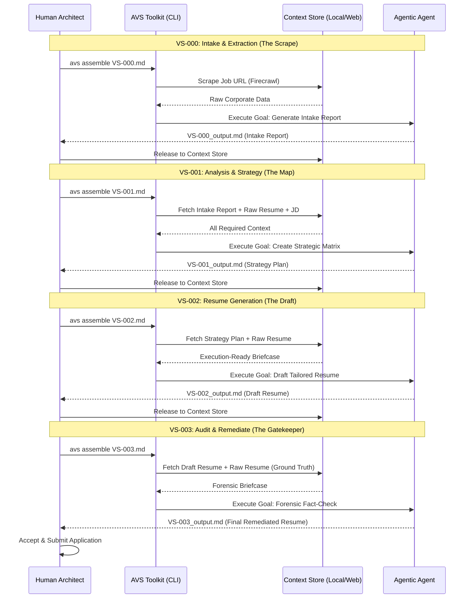

AVS Orchestration Sequence: Job-Hunting Stream

This document illustrates the temporal and data-driven hand-off between the Human Architect, the AVS Toolkit (Automation), and the Agentic Agent. Unlike a standard script, the AVS Framework uses a "Digital Thread" where each product is released back into the context store to fuel the next unit of work.

🔄 The Multi-Story Value Stream

## 🔍 Key Orchestration Principles

### 1. The "Information Hunt" (Assembler)

In each story, the AVS Toolkit (T) performs the hunt for you. In VS-000, it reaches out to the web; in VS-001 through VS-003, it reaches back into the products created in the previous steps. This eliminates "Context Blindness" for the Agent.

### 2. The "Accept & Release" Loop

A product is only used as context once the Human Architect (H) reviews and releases it. This ensures that errors or "hallucinations" in an early stage (like the Intake Report) are caught before they propagate into the Strategy or Resume Draft.

### 3. Algorithmically Legible Handoffs

The handoff is not a vague prompt. It is a Briefcase (.yaml) that contains:

1. **The Goal**: (e.g., "As a Forensic Auditor...")
2. **The Instructions**: (e.g., "Cross-reference every bullet point...")
3. **The Context**: (The actual text of the Raw Resume and the Draft).

Framework Attribution: Patrick Heaney (CC BY-SA 4.0).

Repository: AVS-Orchestration/avs-standard-library